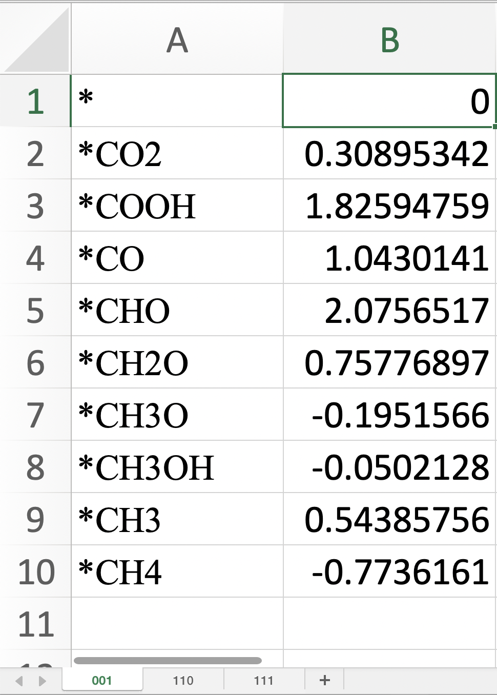
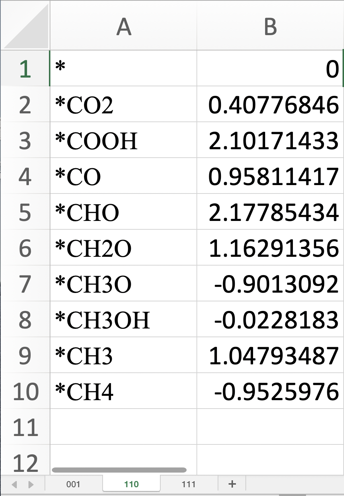
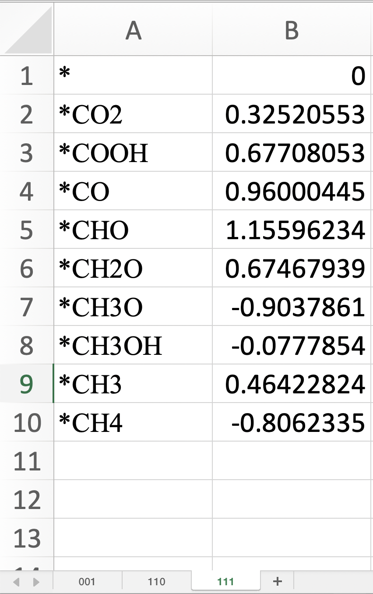

This program is prepared for ploting the energy profile.

## Requirements

- Python 3.8
- numpy 1.21.1
- pandas 1.3.1
- matplotlib 3.4.2

我把我使用的环境`environment.yml`也一起上传到了仓库

## Data Preparation

### input data (xlsx format)

目前的程序中对于各个稳态的能垒是存储在excel文件中的，并且按照一个反应路径一个表单（sheet）的格式进行存储，第一列对应的是每个稳态的名字，第二列对应的是每个态对应的能量值。程序示例中的数据格式如图所示：

<center class="half">
  
</center>

### configure file (plain text)

按照如下格式创建程序的配置文件，类似于gaussian的输入文件。

其中注释行都是以"#"开头，配置文件中的参数分为两个部分，一个是必选参数，这部分参数都放在了**NECESSARY ARGS**里面，另一部分是可选项，放在了**OPTIONAL ARGS**中，所谓可选项顾名思义，就是不需要指定程序也可以正常运行，但是最后的出图可能不够美观。

每个参数的详细作用介绍如下：

---

- FILENAME: 这部分参数主要是指定在input data中创建的xlsx的文件名和目录;
- LEGEND_NAMES: 对应的如果是多个反应路径的自由能变化，我们往往需要在图上标出对应的符号；
- SHEET_NAMES: 每个反应路径数据对应的表单，和input data中的顺序对应；
- COLORS: 指定每个反应路径对应的颜色；

---

- TEXTLABEL: 是否将能量的数值显示在每个水平线上；
- LIMIT: 是否需要人为指定图的Y值的分布范围，如果这里指定为`True`,一定要定义对应的两个参数`YMIN`和`YMAX` 
- YMIN: 指定Y值的最小值；
- YMAX: 指定Y值的最大值；
- FONTSIZE: 图中出现的字体大小，默认为`18` 
- FIGSIZE: 画布的大小，指定和python中有一定出入`14,6` 不需要指定括号"()"
- XLABEL: 图中X轴的标题；
- YLABEL: 图中Y轴的标题；
- OUTPUT: 最后出图的文件名和地址，默认值是在当前目录下的`example.png` 

```
# filename: input.txt
# An example of the input file
# Comment is started with symbol '#'
#                           Created by Qiang @ Zhengjiang

*NECESSARY ARGS*
FILENAME: /Users/zhuqiang/Documents/My_Jobs@Nanjing/WorkHotel/NO3RR/Energy_Profile/example/example.xlsx            # here is the input data and should be the absolute path
LEGEND_NAMES: 001, 110, 111    # name of legend
SHEET_NAMES:  001,110,111     # sheet of input data
COLORS: black, blue, grey      # color of each pathway


*OPTIONAL ARGS*
TEXTLABEL: False               # Show the value of energies
LIMIT:    True                 # optioinal: specify the YMIN and YMAX manually
YMIN:     -2                         # optional: you can specify and will overwrite the one self-generated
YMAX:      5                        # same as YMIN
FONTSIZE: 18                     # fontsize of the number and legends
FIGSIZE: 14,6                  # size of the canvas
XLABEL:  Reaction Pathway        # xlabel for the figure
YLABEL:  Free Eenergy $\Delta G$ (eV)       # ylabel for the figure
OUTPUT: ./example.png             # output name for the figure
```

 ## Usage

准备上述的两个文件xlsx格式原始数据和可读的文本格式的输入文件，将代码下载到本地。

编写一个python脚本或者直接在terminal中输入如下命令：

第一步是导入我们编写的程序`DeltaG_plot.main`中的相关程序，第二部是绘制图片`plot`或者直接将图片保存`saveplot` 

```bash
%python
Python 3.8.10 | packaged by conda-forge | (default, May 11 2021, 06:27:18)
[Clang 11.1.0 ] on darwin
Type "help", "copyright", "credits" or "license" for more information.
>>> from DeltaG_plot.main import plot
>>> plot('example/input.txt')

-or-
%python
Python 3.8.10 | packaged by conda-forge | (default, May 11 2021, 06:27:18)
[Clang 11.1.0 ] on darwin
Type "help", "copyright", "credits" or "license" for more information.
>>> from DeltaG_plot.main import saveplot
>>> saveplot('example/input.txt')
```


## OUTPUT

<div align="center">

 </div>


### Reference

- Cheng, Xiao-Mei, et al. "Crystallographic facet heterojunction of MIL-125-NH2 (Ti) for carbon dioxide photoreduction." *Applied Catalysis B: Environmental* (2021): 120524. 

